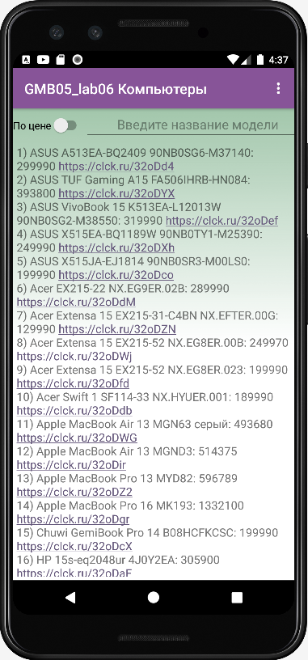
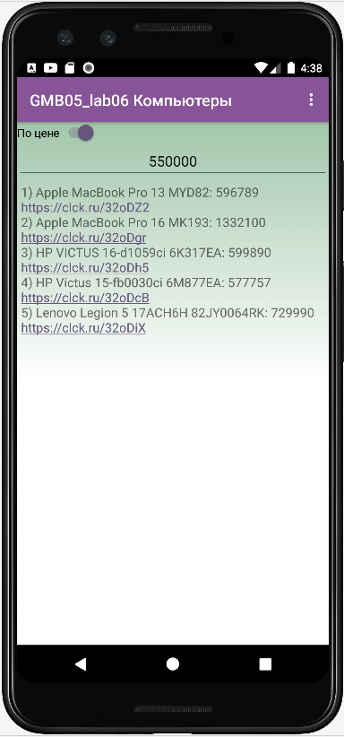

# GMB05_lab06_AndroidStudio
Practical work 6. In the discipline of Mobile application development




Запрос фильтрации
```
if (filter1.equals("")) {
    selectQuery = "SELECT  * FROM " + TABLE_NAME + " ORDER BY " + NAME;
} else {
    selectQuery = "SELECT  * FROM " + TABLE_NAME + " WHERE " + PRICE + " >= "+ filter1+"  ORDER BY " + NAME;
    System.out.println(selectQuery);
}
```

Teacher: https://github.com/proffix4
